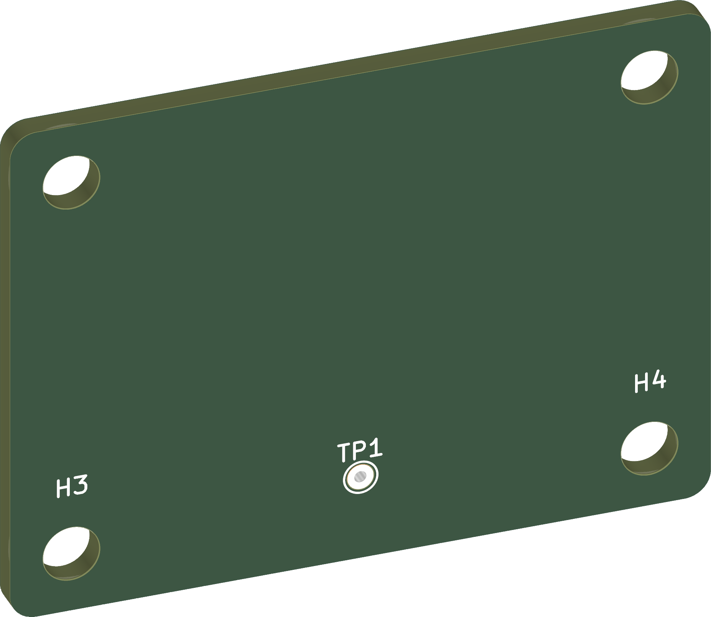
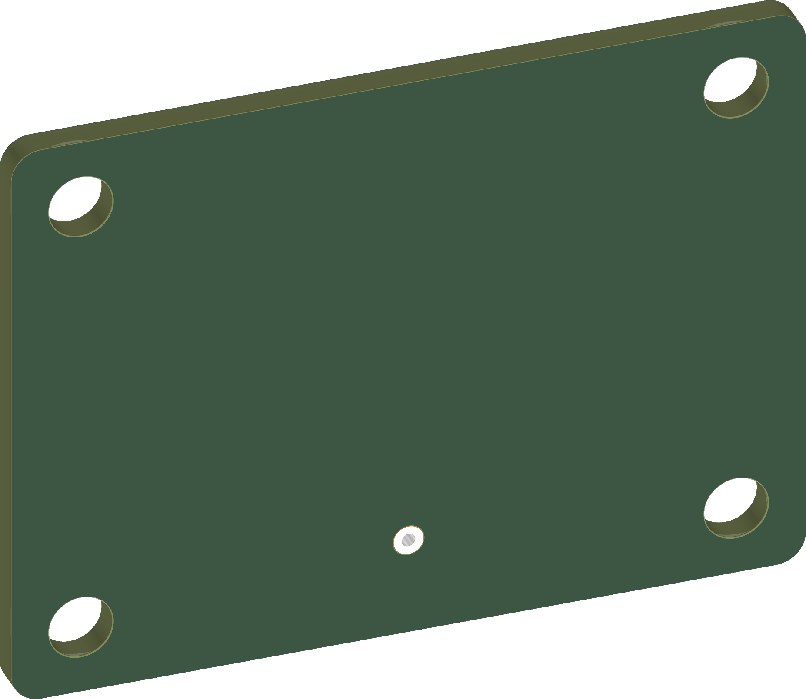

  

<h1 align="center">Board Name</h1>

  

> [!NOTE]
> This file is generated by KiBot from `kibot_resources/templates/readme.txt`.
> Edit the template, not this file. The template documentation is in
> [docs/TEMPLATE_GUIDE.md](docs/TEMPLATE_GUIDE.md), every setting in
> [docs/CONFIG_REFERENCE.md](docs/CONFIG_REFERENCE.md), instructions for coding agents in
> [AGENTS.md](AGENTS.md).

  
&nbsp; &nbsp; &nbsp; &nbsp;
  

***

## SPECIFICATIONS

| Parameter | Value |
| --- | --- |
| Project | Project Name |
| Revision | (Unreleased) |
| Status | DRAFT |
| Dimensions | 40.0 × 30.0 mm |
| Thickness | 1.61 mm |
| Copper layers | 4 |

***

## DOCUMENTS

| Document | File |
| --- | --- |
| Schematic | [PDF](Schematic/KiCad10_KiBot_Template-schematic.pdf) |
| PCB routing | [PDF](PCB/KiCad10_KiBot_Template-routing.pdf) |
| Gerber layers | [PDF](Manufacturing/Fabrication/KiCad10_KiBot_Template-gerbers.pdf) |
| Fabrication document | [PDF](Manufacturing/Fabrication/KiCad10_KiBot_Template-fabrication.pdf) |
| Assembly document | [PDF](Manufacturing/Assembly/KiCad10_KiBot_Template-assembly.pdf) |
| Fabrication files (Gerbers, drill, fab. PDF) | [ZIP](Manufacturing/Fabrication/KiCad10_KiBot_Template-GERBERS.zip) |
| ODB++ | [ZIP](Manufacturing/Fabrication/KiCad10_KiBot_Template-odb.zip) |
| JLCPCB order files (Gerbers ZIP, BoM, pick and place) | [Folder](Manufacturing/JLCPCB) |
| Bill of Materials | [CSV](Manufacturing/Assembly/KiCad10_KiBot_Template-bom.csv) · [HTML](Manufacturing/Assembly/KiCad10_KiBot_Template-bom.html) · [Interactive](Manufacturing/Assembly/KiCad10_KiBot_Template-ibom.html) |
| Pick and place | [CSV](Manufacturing/Assembly/KiCad10_KiBot_Template-CPL.csv) |
| 3D model | [STEP](3D/KiCad10_KiBot_Template.step) |

> [!TIP]
> In the DRAFT status only the schematic, netlist and BoM are generated.

***

## DIRECTORY STRUCTURE

    .
    ├─ 3D                 # STEP (and PCB3D for Blender) models
    ├─ Computations       # Misc calculations
    ├─ docs               # Template documentation
    ├─ HTML               # HTML files for the generated webpage
    ├─ Images             # Pictures and 3D renders
    │
    ├─ kibot_resources    # External resources for KiBot
    │  ├─ colors          # Color theme for KiCad
    │  ├─ fonts           # Fonts used in the project
    │  ├─ scripts         # External scripts used with KiBot
    │  └─ templates       # Templates for KiBot generated reports
    │
    ├─ kibot_yaml         # KiBot YAML config files
    ├─ KiRI               # KiRI (PCB diff viewer) files
    ├─ Logos              # Logos
    │
    ├─ Manufacturing      # Assembly and fabrication documents
    │  ├─ Assembly        # Assembly documents (BoM, pos, notes)
    │  ├─ Fabrication     # Fabrication documents (ZIP, ODB++, notes, Gerbers PDF)
    │  │  ├─ Drill Tables # CSV drill tables
    │  │  └─ Gerbers      # Gerbers and drill files
    │  └─ JLCPCB          # JLCPCB order files
    │
    ├─ PCB                # PCB routing PDF
    ├─ Reports            # ERC/DRC reports
    ├─ Schematic          # Schematic PDF
    ├─ Templates          # Title block templates
    ├─ Testing
    │  └─ Testpoints      # Testpoints tables
    │
    └─ Variants           # Outputs for assembly variants
